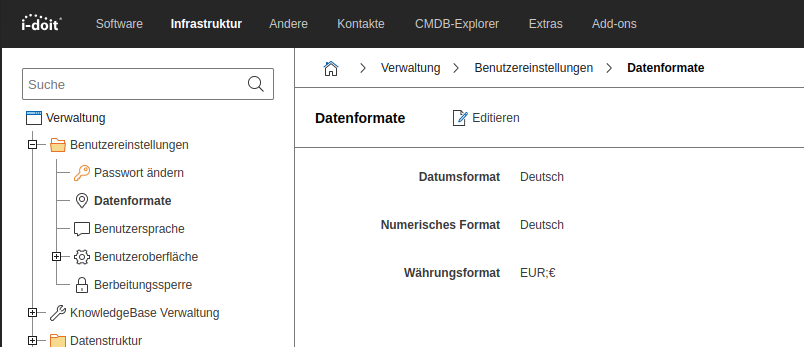

# Datenformate

Der Benutzer hat die Möglichkeit verschiedene Datenformate auszuwählen.

| Option | Wert |
| - | - |
| Datumsformat | Englisch/Deutsch |
| Numerisches Format | Englisch/Deutsch |
| Währungsformat | `EUR;€` oder `USD;$` oder `GBP;£` oder `CHF;Sfr.` |
