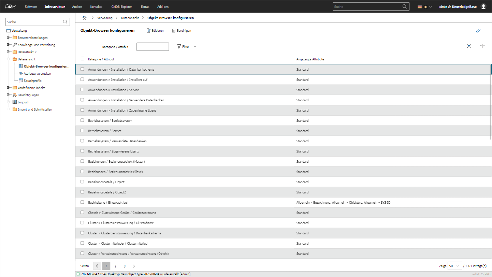
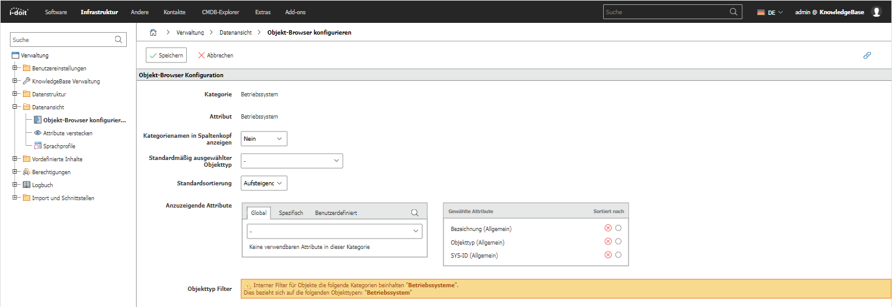

# Objekt-Browser konfigurieren

Hier kann man den Objekt-Browser konfigurieren indem man die Attribute, welche man sehen will hinzufügt. Dazu muss man zu der Kategorie oder dem Attribut navigieren, welches man für den Objekt-Browser konfigurieren will.

Nun ist es möglich, Attribute zur ausgewählten Kategorie hinzuzufügen und festzustellen, welche Kategorie dem Objekt hinzugefügt werden muss, um sicherzustellen, dass es im Objekt-Browser für dieses spezifische Attribut angezeigt wird.

