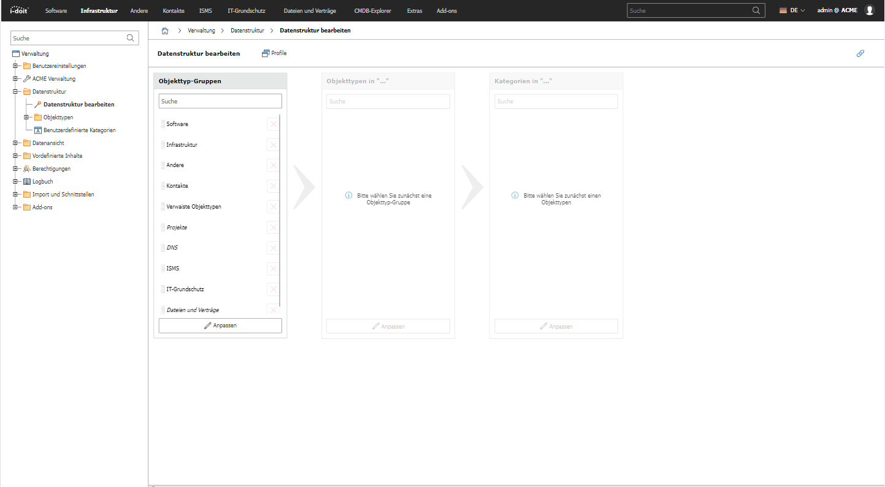
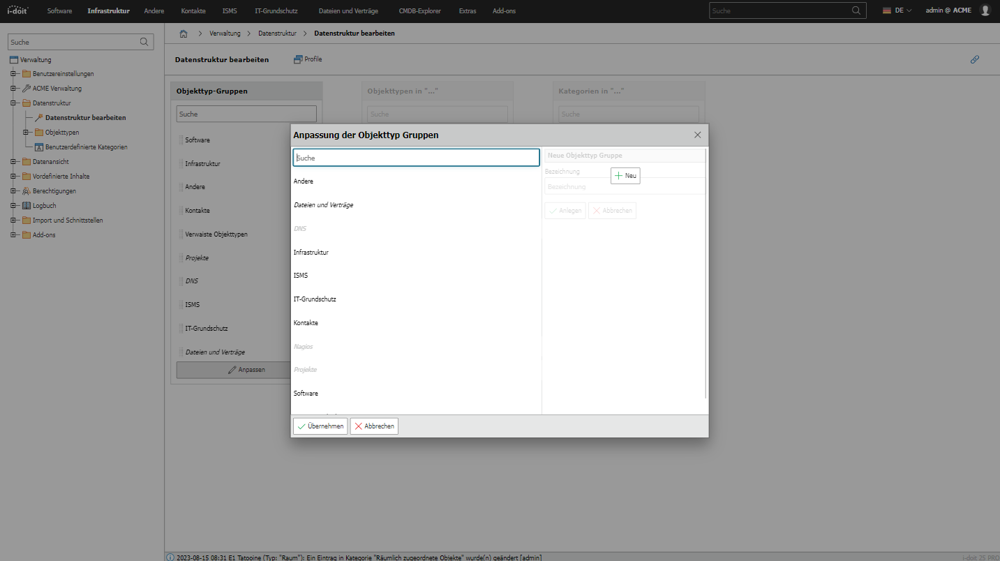

# Datenstruktur bearbeiten

Hier finden Sie Konfigurationen, mit denen Sie die Datenstruktur Ihres Mandanten verändern können.

Die Konfiguration der Zuordnungen erfolgt über eine Aufteilung in drei Spalten. Diese Spalten repräsentieren Ihren ==Objekttyp Gruppen==, ==Objekttypen== und ==Kategorien==. In jeder Spalte befindet sich pro Zeile ein ==gepunkteter Bereich==, mit welchem Sie die Reihenfolge per Drag and Drop ändern können.

## Anpassen von Objektgruppen, Objekttypen und Kategorien

In allen drei Hauptfeldern können Sie durch Drücken des ==Anpassen Buttons== in den Bearbeitungsmodus wechseln.
Hier können Sie die Zuordnungen der jeweiligen ==Objektgruppen bearbeiten==, aber auch neue Gruppen, Objekttypen oder Kategorien anlegen und entwickeln.

## Bearbeitung der Zuordnungen

Sie können die Bearbeitung in der Spalte ==Objekttyp Gruppen== beginnen. Hier können Sie die ==Objekttyp Gruppe== auswählen, für welche Sie die Objekttypenzuordnungen anpassen wollen. 
Klicken Sie auf die ==Objekttyp Gruppe==, die Sie bearbeiten wollen, so dass in der mittleren Spalte eine Auswahl zur erscheint. Falls Sie die Gruppen nicht benötigen, können Sie sie mit Hilfe der Kontrollkästchen oder der Schaltfläche ==Anpassen== ausblenden.

Wenn eine Gruppe ausgewählt wurde und die mittlere Spalte aktiv ist, können Sie feststellen, welche ==Objekttypen== den entsprechenden Gruppe zugeordnet sind. ==Objekttypen== die ausgegraut werden, sind bereits anderen Gruppen zugeordnet, können aber noch neu zugeordnet werden.

Unten in der Objektgruppenspalte können Sie ==benutzerdefinierte Gruppen== hinzufügen. Mit dem Stift Icon kann man diese jederzeit bearbeiten oder löschen.

Dasselbe gilt für die Spalte Objekttyp. Hier können Sie [eigene Objekttypen](../../../grundlagen/benutzerdefinierte-objekttypen.md) anlegen. Für eine umfangreiche Konfiguration eines Objekttyps empfehlen wir jedoch die Verwendung der [Objekttyp Konfiguration](../../../grundlagen/benutzerdefinierte-objekttypen.md).

Wenn Sie auf einen Objekttyp in der mittleren Spalte klicken, wird die rechte Spalte aktiviert. Hier sehen Sie die Kategorien, die dem ausgewählten Objekttyp zugeordnet sind und können die Zuordnungen über die Kontrollkästchen ändern oder entfernen.

Die Schaltfläche ==Benutzerdefinierte Kategorien erstellen== leitet Sie direkt zur Funktion zum Erstellen von [benutzerdefinierten Kategorien](../../../grundlagen/benutzerdefinierte-kategorien.md) weiter.

## Datenstrukturprofile bearbeiten

Sie können Ihre aktuelle Konfiguration in Form eines Profils speichern. Geben Sie dazu unter ==Aktuelles Profil speichern== einen Namen für das Profil ein. Das Profil erscheint dann in den verfügbaren Profilen in der rechten Spalte. Hier ist es möglich, das Profil zu aktivieren, zu löschen oder herunterzuladen. Aktivieren Sie das Kontrollkästchen des gewünschten Profils und klicken Sie auf ==Ausgewählte(s) Profil(e)== laden, um die Zuordnung aus dem ausgewählten Profil wiederherzustellen. Über den Download-Button können Sie das Profil als XML-Datei speichern und bei Bedarf über den Button ==Datei wählen== wieder hochladen. Mit dem roten X-Symbol können Sie das ausgewählte Profil löschen.

Diese Funktion ist geeignet, um Konfigurationsdaten zwischen mehreren _i-doit_ Installationen auszutauschen. Ein Profil enthält die folgenden Einstellungen:

-   Objekttyp Gruppen mit Namen, Reihenfolge und weiteren Attributen
-   Objekttypen mit Namen, Zuordnungen zu Objekttyp Gruppen und weiteren Attributen aus der Objekttyp Konfiguration
-   Globale, spezifische und benutzerdefinierte Kategorien, die jedem Objekttyp zugeordnet sind
-   Konfiguration jeder benutzerdefinierten Kategorie, die mindestens einem Objekttyp zugeordnet ist

Ein Profil enthält demnach die Konfiguration der IT-Dokumentation, aber keine Inhalte. Weder Objekte, Kategorieeinträge noch ausgefüllte Dialogfelder werden gespeichert.

Wenn Sie einen leeren Zustand wünschen, um die Zuordnungen von Grund auf neu vorzunehmen, können Sie über die Schaltfläche ==Reset== alle Zuordnungen zurücksetzen.
