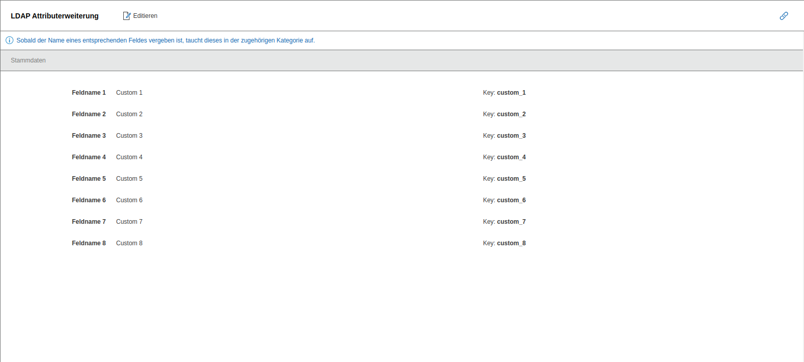

# LDAP Attributerweiterung

Mit dieser Funktion können Sie die Namen der Felder aus der LDAP-Konfigurationsdatei anpassen. → [WEITERLESEN](../../../../benutzerauthentifizierung-und-verwaltung/ldap-verzeichnis/index.md)

