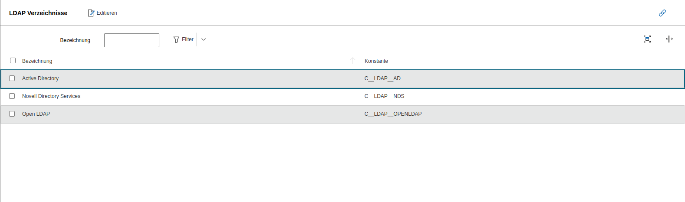

# Directories

Hier können die Abbildungsattribute angegeben werden, die für die [LDAP Schnittstelle](../../../../benutzerauthentifizierung-und-verwaltung/ldap-verzeichnis/index.md) verwendet werden.

