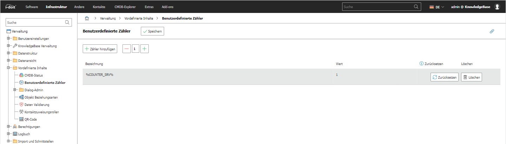

# Benutzerdefinierte Zähler

Hier können Sie benutzerdefinierte Zähler zu Ihrem i-doit hinzufügen. Um die Zähler zu konfigurieren, überprüfen Sie Folgendes. → [WEITERLESEN](../../../grundlagen/benutzerdefinierte-zaehler.md)

