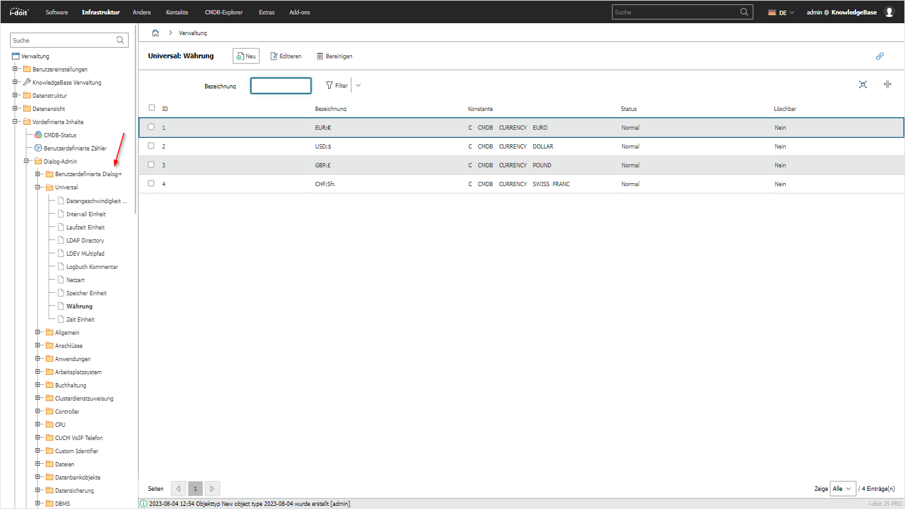

# Dialog-Admin

Mit dem Dialog-Admin können Sie die Inhaltsvorlagen aller Dialog+ Felder organisieren und bearbeiten. Hier finden Sie auch die benutzerdefinierten Dialog+ Felder. → [WEITERLESEN](../../../grundlagen/dialog-admin.md)

