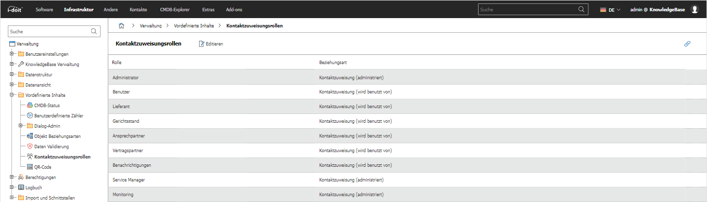

# Kontaktzuweisungsrollen

In i-doit bieten die Kontaktzuweisungsrollen die Möglichkeit, die Art der Funktion bei der Kontaktzuweisung zu definieren. Hier können Sie die Kontaktzuordnungsrollen zentral verwalten.

