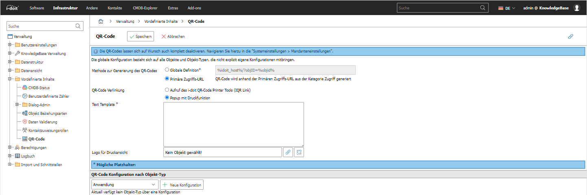

# QR-Code

Legen Sie in diesem Dialog die Konfiguration für den QR-Code fest. Sie können wählen, ob der QR-Code die primäre Zugriffs-URL von Objekten als Inhalt enthalten soll oder ob eine globale Definition verwendet werden soll. Darüber hinaus können Sie entscheiden, was passiert, wenn Sie auf einen angezeigten QR-Code klicken. → [WEITERLESEN](../../../i-doit-add-ons/i-doit-qr-code-printer.md)

