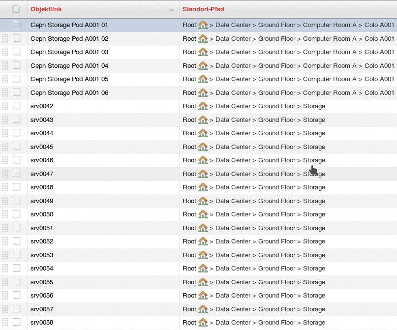

# Navigieren und filtern

Durch eine [Objekt-Liste](index.md) zu navigieren und nach bestimmten [Objekten](../struktur-it-dokumentation.md) zu filtern ist keine große Kunst. Und trotzdem lohnt sich ein genauer Blick.

## Navigieren

Längere Objekt-Listen verteilen sich über mehrere Seiten, die sich gezielt ansteuern lassen. Über den Button **...** kann eine bestimmte Seite angegeben werden.

Pro Benutzer kann festgelegt werden, [wie viele Objekte pro Seite dargestellt](erweiterte-einstellungen.md) werden sollen. Zudem kann diese Einstellung über ein Drop-Down-Menü übergangen werden und daher 50, 100, ... oder gar alle Objekte auf einer Seite dargestellt werden.

!!!success "Tastaturbefehle"
    Die Objekt-Liste lässt sich via Tastatur bedienen. Folgende Befehle sind möglich:

    | Taste               | Funktion                                                    |
    | ------------------- | ----------------------------------------------------------- |
    | **Runter**          | Springe in die nächste Zeile                                |
    | **Hoch**            | Springe in die vorherige Zeile                              |
    | **Leertaste**       | Markiere ein Objekt, d. h. wähle die jeweilige Checkbox aus |
    | **Shift+Leertaste** | Wähle einen Bereich von Objekten aus                        |

    Um einen Bereich von Objekten auszuwählen, kann die Shift-Taste auch in Kombination mit der linken Maustaste verwendet werden.

    

## Filtern

Die Zeilen einer Objekt-Liste können nach Attributen gefiltert werden. Eines der angezeigten Attribut ist für den [Standardfilter](listenansicht-konfigurieren.md) vorgesehen. Es kann direkt danach gefiltert werden, wobei **ab 3 Zeichen** Vorschläge generiert werden. Wählt man einen dieser Vorschläge aus, wird nicht die Liste danach gefiltert, sondern das Objekt geladen.

Zudem kann über ein Drop-Down-Menü nach mehreren Attributen gleichzeitig gefiltert werden (Und-Verknüpfung). Bestätigt wird der Filter durch Klick auf den Button **Filtern**. Der ausgewählte Filter wird zudem in einer Text-Leiste angezeigt. Die Filterung kann über den entsprechenden Button wieder zurückgesetzt werden.

Seit Version 1.17 kann auch nach leeren Werten gefiltert werden. Dazu muss eine oder mehrere Checkbox/en, hinter dem jeweiligen Wert, markiert werden.

Die Objekt-Liste kann bereits beim Laden [gefiltert](listenansicht-konfigurieren.md) werden.

## Weitere Funktionen

Über die Navigations- und Filterleiste sind weitere Funktionen zugänglich:

| Button                                                                                                                                                                                                             | Funktion                                                                                                                    |
| ------------------------------------------------------------------------------------------------------------------------------------------------------------------------------------------------------------------ | --------------------------------------------------------------------------------------------------------------------------- |
|    | Die Objekt-Liste wird neu geladen                                                                                           |
|  | Die Spaltenbreiten werden automatisch festgelegt. Die Spalten lassen sich andernfalls pro Benutzer in der Breite variieren. |
|                                                                 | [Listenansicht konfigurieren](listenansicht-konfigurieren.md)                                                               |
