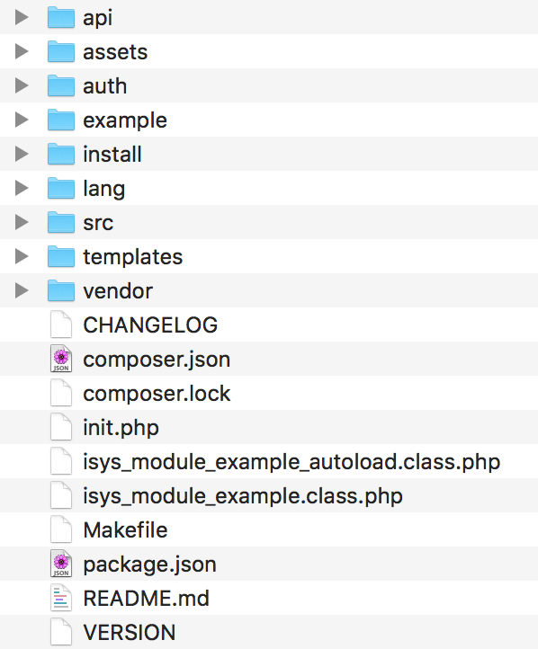

# Add-ons installieren, aktualisieren und aktivieren

Damit ein Add-on in i-doit installiert, aktualisiert und aktiviert werden kann, ist eine bestimmte Ordnerhierarchie einzuhalten. Innerhalb des Add-on-Ordners werden Dateien, wie z.B. init.php, vorausgesetzt, um einen einheitlichen Programmablauf zu gewährleisten.

Add-on installieren
-------------------

Add-ons müssen als ZIP-Archiv vorliegen, um von i-doit installiert werden zu können. Die ZIP-Datei wird über das Admin-Center eingespielt und startet die internen Routinen zum Installieren. Die Verzeichnisstruktur innerhalb des Archivs muss dabei einem vorgegebenem Muster folgen. Hier am Beispiel des "Beispiel"-Add-ons (Identifier "example"):

Im Archiv muss die package.json\-Datei auf oberster Ebene (wie auch src) liegen, damit diese von i-doit gefunden wird. Diese beinhaltet diverse wichtige Metadaten, die während der Installation benötigt werden. Weitere Informationen sind im Artikel [Metadaten eines Add-ons (package.json)](metadaten-eines-add-ons.md) nachzulesen.

Die Datei wird nach erfolgreicher Installation automatisch in das Add-on-Verzeichnis verschoben.

Add-on aktualisieren
--------------------

Anders als beim i-doit-Kern gibt es bei Add-ons keinen Unterschied zwischen "installation"- und "update"-Paketen. Die Entscheidung zwischen "Was passiert bei Installation?" und "Was passiert bei Aktualisierung?" wird im Kapitel "Installieren und Deinstallieren" näher erläutert.

System- und Mandanten-Datenbank erweitern
-----------------------------------------

Häufig erweitert ein Add-on die i-doit-Mandanten-Datenbank um eigene Tabellen und Inhalte. Zu diesem Zweck kann ein Add-on die Dateien update_data.xml und update_sys.xml mitbringen, die im Add-on-Verzeichnis unterhalb des "install"-Ordners liegen müssen. Hier werden unter definierten Bedingungen SQL-Queries ausgeführt, die sowohl zum Installieren als auch Aktualisieren von Datenbank-Tabellen und -Inhalten genutzt werden können. Die Datei update_data.xml wird für die gewählten Mandanten-Datenbanken verwendet, während update_sys.xml ausschließlich auf die System-Datenbank angewendet wird.

    <?xml version="1.0" encoding="UTF-8"?>
    <!DOCTYPE isys [
        <!ELEMENT isys (info|queries)*>
        <!ELEMENT info (title|version|requirement|directory|revision|release)*>
        <!ELEMENT title (#PCDATA)>
        <!ELEMENT version (#PCDATA)>
        <!ELEMENT requirement (revision|version)*>
        <!ELEMENT revision (#PCDATA)>
        <!ELEMENT directory (#PCDATA)>
        <!ELEMENT release (#PCDATA)>
        <!ELEMENT queries (query)*>
        <!ELEMENT query (id|title|check|errmsg|sql)*>
        <!ELEMENT id (#PCDATA)>
        <!ELEMENT check (#PCDATA)>
        <!ATTLIST check ident CDATA #REQUIRED>
        <!ELEMENT errmsg (#PCDATA)>
        <!ELEMENT sql (exec)*>
        <!ELEMENT exec (#PCDATA)>
        <!ATTLIST exec ident CDATA #REQUIRED>
        ]>
    <isys>
        <info>
            <title>Beispiel Add-on</title>
            <version>1.0</version>
            <release>2018-08-01</release>
        </info>
        <queries>

            <!-- Queries and conditions go here -->

        </queries>
    </isys>

Ein Query-Element muss immer die folgenden Elemente mitliefern:

*   id: Ein numerischer Counter, beginnend bei 1
*   title: Ein beschreibender Titel, der erläutert, welche Query aktuell ausgeführt wird.
*   check: Der notwendige Check + Bedingung
*   errmsg: Ein optionaler Text, der im Fehlerfall ausgegeben wird.
*   sql: Die auszuführende SQL-Query, unter Berücksichtigung des Check-Ergebnisses

Solche Queries können folgendermaßen aussehen:

    <query>
        <id>1</id>
        <title>Creating table "isys_example_table"</title>
        <check ident="C_CREATE_TABLE">isys_example_table</check>
        <errmsg>The example table could not be created!</errmsg>
        <sql>
            <exec ident="true">

                <!-- Nothing to do, the table exists -->

            </exec>
            <exec ident="false">
                CREATE TABLE isys_example_table ...;
            </exec>
        </sql>
    </query>

    <query>
        <id>2</id>
        <title>Setting title of object #1 to "Root-Location"</title>
        <check ident="C_VALUE_EXISTS">
            SELECT isys_obj__id FROM isys_obj WHERE isys_obj__id = 1;
        </check>
        <errmsg>The example table could not be created!</errmsg>
        <sql>
            <exec ident="true">
                <!-- Object with ID 1 exists -->
                UPDATE isys_obj
                SET isys_obj__title = 'Root-Location'
                WHERE isys_obj__id = 1;
            </exec>
            <exec ident="false">
                <!-- Object with ID 1 could not be found -->
                INSERT INTO isys_obj
                SET isys_obj__id = 1,
                isys_obj__title = 'Root-Location';
            </exec>
        </sql>
    </query>

Es ist möglich, für jeden Ausgang des Checks (true / false) eine SQL-Query zu hinterlegen.

Folgende Checks und Bedingungen sind möglich:

*   C_CREATE_TABLE (inkl. Alias "C_UPDATE", "C_INSERT_INTO", "C_ALTER_TABLE", "C_TABLE_EXISTS" und "C_DROP_TABLE")
    Bedingung: Tabellen-Name
    Prüft, ob die angegebene Tabelle existiert.
*   C_VALUE_EXISTS
    Bedingung: SQL-Query
    Führt die angegebene Query aus und prüft, ob es eine Rückgabe gibt (gefundene Zeilen > 0).
*   C_ADD_FIELD
    Bedingung: Tabelle und Spalte in folgender Form: <Tabelle>,<Spalte>
    Prüft, ob das genannte Feld in der Tabelle existiert.

Aktivieren und Deaktivieren
---------------------------

Damit ein Add-on im Admin-Center aktiviert und deaktiviert werden kann, muss die isys_module_example\-Klasse das idoit\AddOn\ActivatableInterface\-Interface implementieren. Dieses setzt drei Methoden voraus, die bei den entsprechenden Aktionen ausgeführt werden:

    /**
    * Checks if a module is active.
    *
    * @return integer|bool
    */
    public static function isActive()
    {
        return isys_module_manager::instance()->is_active('example');
    }

    /**
    * Method that is called after clicking "activate" in Admin-Center for specific mandator
    *
    * @param isys_component_database $mandatorDb
    *
    * @return boolean
    */
    public static function activate($mandatorDb)
    {
        try {
            // Custom logic...
            return true;
        } catch (Exception $e) {
            return false;
        }
    }

    /**
    * Method that is called after clicking "deactivate" in Admin-Center for specific mandator
    *
    * @param isys_component_database $mandatorDb
    *
    * @return boolean
    */
    public static function deactivate($mandatorDb)
    {
        try {
            // Custom logic...
            return true;
        } catch (Exception $e) {
            return false;
        }
    }

Werden die Methoden nicht benötigt, kann lediglich true zurückgegeben werden. Üblicherweise werden diese Methoden dazu genutzt, um zum Beispiel Rechte zu setzen oder Dashboard-Widgets zu installieren.

Installieren und Deinstallieren
-------------------------------

Ähnlich wie beim Aktivieren und Deaktivieren eines Add-ons, gibt es auch zum Installieren und Deinstallieren ein entsprechendes Interface: idoit\AddOn\InstallableInterface. Auch dies setzt drei Methoden voraus, die zwingend implementiert werden müssen:

    /**
    * Checks if a add-on is installed.
    *
    * @return integer|bool
    */
    public static function isInstalled()
    {
        return isys_module_manager::instance()->is_installed('example');
    }

    /**
    * Basic installation process for all mandators.
    *
    * @param  isys_component_database $tenantDatabase
    * @param  isys_component_database $systemDatabase
    * @param  integer                 $moduleId
    * @param  string                  $type
    * @param  integer                 $tenantId
    *
    * @since  i-doit 1.12
    * @return void
    */
    public static function install($tenantDatabase, $systemDatabase, $moduleId, $type, $tenantId)
    {
        if ($type === 'install') {
            // Logic for installation.
    }

        if ($type === 'update') {
            // Logic for update.
        }
    }

    /**
    * Uninstall add-on for all mandators
    *
    * @return void
    */
    public static function uninstall()
    {
        // Custom logic...
    }

Die install\- und uninstall\-Methoden können benutzt werden, um komplexe Aufgaben zu erledigen, die über einfache SQL-Queries hinausgehen.

!!! info "Veraltete Installationslogik"

    In älteren i-doit-Versionen (< 1.12) wird die "install"-Methode noch nicht unterstützt - hier muss eine separate Logik angewendet werden.
