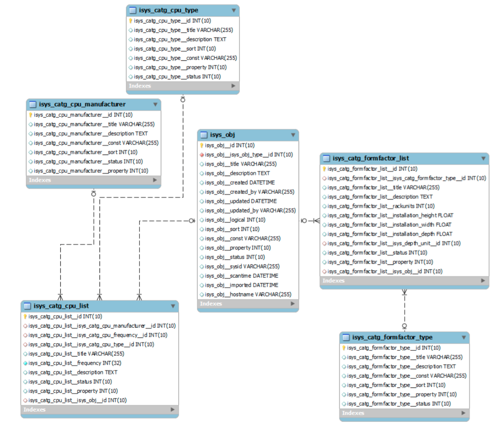
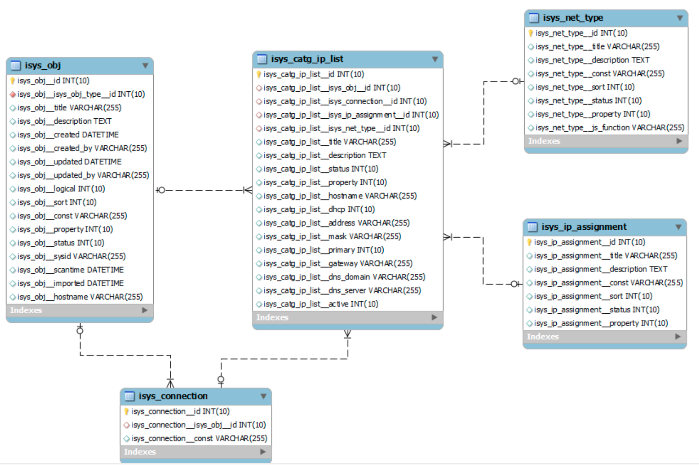

# Datenbank-Modell

i-doit speichert die meisten Inhalte und Einstellungen in einem Database Management System (DBMS) ab. Als DBMS kommen [MySQL oder MariaDB](../../installation/systemvoraussetzungen.md) zum Einsatz. Doch wie ist das Datenbank-Modell von i-doit aufgebaut?

Grundsätzliches
---------------

Einige der insgesamt über 400 Tabellen der Mandanten Datenbank sind über ein definiertes Namensschema aufgebaut. So haben beispielsweise alle i-doit Tabellen das Präfix "isys\_".
  
CMDB Kategorien folgen mit der Kennung "cats" für spezifisch und "catg" globale Kategorien und enden mit der englischen Bezeichnung der entsprechenden Kategorie und dem Suffix \_list (z.B. isys\_catg\_model\_list, isys\_catg\_memory\_list). Die Kategorie Tabellen machen 50% der gesamten Datenbank aus. Ein weiterer großer Teil der Tabellen sind Dialog Listen, mit denen Comboboxen gefüllt werden. Viele dieser speziellen Listen beinhalten Werte über Typ und Hersteller und sind somit durch Namen wie zum Beispiel "type" oder "manufacturer" erkenntlich.

Referenzierungen (Foreign Keys)
-------------------------------

Zur Vermeidung von Redundanzen innerhalb des Datenschemas, sind die i-doit Datenbanken relational aufgebaut und nach dem Schema der 3. Normalform normalisiert. Fremdschlüssel haben eine einheitliche Benamung (siehe hierzu Abschnitt "Namensschema"), wodurch sie direkt ersichtlich werden.

Namensschema
------------

Neben der Benennung der einzelnen Tabellen, zieht sich ein konsequentes Namensschema durch alle Feldbezeichnungen der i-doit Tabellen, welches mit dem Namen der Tabelle beginnt, gefolgt von dem eigentlichen Namen der Spalte. Somit heisst das id Feld der Tabelle isys\_catg\_cpu\_list zum Beispiel:

    isys_catg_cpu_list__id
    /\              /\
    Tabelle CPU            Spalte (ID)
    isys_catg_cpu_list__title
    /\               /\
    Tabelle CPU            Spalte (Titel)

Referenzen auf andere Felder (Fremdschlüssel) folgen analog hierzu einem ähnlichen Grundsatz. Eine Referenz beinhaltet immer den kompletten Namen der referenzierten Spalte, so ist anhand des Namens immer ersichtlich, auf welche Tabellenspalte die Referenz zeigt.

Beispiel Objektreferenz einer Kategorie:

    isys_catg_cpu_list__isys_obj__id
    /\                 /\      /\
    Tabelle CPU    Tabelle Obj.   Spalte

Objekte
-------

Jedes Objekt ist jeweils ein Datensatz in der Tabelle _isys\_obj_. In dieser Tabelle werden Eigenschaften wie der Objekttyp (Server, Clients, Router, etc.), das Erstellungsdatum, der Status (Normal, Archiviert, Gelöscht) und einige zusätzliche Attribute festgehalten. Die Bestimmung des Objekttypen erfolgt durch die Referenzierung der Tabelle _isys\_obj\_type,_ in der sich die entsprechende Ausprägung und Lokation (Infrastruktur, Software etc.) befindet.

Globale und spezifische Kategorien
----------------------------------

Jede Kategorie spiegelt sich in der Datenbank als eigene Tabelle wieder und steht in einer 1:n Beziehung zum Objekt. Es wird grundsätzlich zwischen Listen und Single Values unterschieden. Single Values sind einfache Einträge (z.B. Buchhaltung oder Formfaktor), von denen pro Objekt genau ein Eintrag in der Tabelle existiert. Listen dagegen ermöglichen Mehrfacheintragungen (CPU, Speicher, Ports, ..). In jedem Datensatz der globalen Kategorie wird auf ein einzelnes Objekt referenziert.

Beispielaufbau globale Kategorie Grafikkarte und globale Kategoire IP Adressen:

isys\_catg\_graphic\_list steht über den Fremdschlüssel isys\_catg\_graphic\_list\_\_isys\_obj\_\_id in Beziehnung zum Objekt. Über das gleiche Schema steht die IP Adresse in Verbindung zum Objekt:  
isys\_catg\_ip\_list beinhaltet den Fremdschlüssel isys\_catg\_ip\_list\_\_isys\_obj\_\_id.

Somit ergibt sich folgenes SQL Statement für die Ermittlung alle Objekte, dessen Grafikkarte und IP Infos:

    SELECT
    isys_obj__title,
    isys_catg_graphic_list__title,
    isys_catg_graphic_list__memory,
    isys_memory_unit__title,
    isys_catg_ip_list__hostname,
    isys_catg_ip_list__address
    FROM isys_obj
    INNER JOIN isys_catg_graphic_list
    ON isys_catg_graphic_list__isys_obj__id = isys_obj__id
    INNER JOIN isys_memory_unit
    ON isys_catg_graphic_list__isys_memory_unit__id = isys_memory_unit__id
    INNER JOIN isys_catg_ip_list
    ON isys_catg_ip_list__isys_obj__id = isys_obj__id

Spezifische Kategorien verhalten sich gleich. Die Abfrage der Netzinformationen aller Netz Objekte würde folgendermaßen aussehen:

    SELECT
    isys_obj__title,
    isys_cats_net_list__address,
    isys_cats_net_list__dhcp_range_from,
    isys_cats_net_list__dhcp_range_to,
    isys_cats_net_list__dhcp,
    isys_cats_net_list__def_gw
    FROM
    isys_cats_net_list
    INNER JOIN isys_obj
    ON isys_cats_net_list__isys_obj__id = isys_obj__id

**Diagramm: Beziehung zwischen Kategorien und Objekten**

**  
**

In der Grafik ist zu sehen wie ein Objekt mit der globalen Kategorie CPU verknüpft ist. Diese Kategorie greift wiederum auf  Dialog+ Einträge wie den Hersteller und den Typ zu. Das gleiche geschieht mit der globalen Kategorie Formfaktor, die auf den Formfaktor-Typ zugreift.

Diese Darstellung erläutert die Beziehungen eines Objektes zur Kategorie "Hostadresse" (IP). Das Objekt selbst (z.B. Server1) befindet sich in der Tabelle isys\_obj. Die zugewiesenen IP Adressen in der Tabelle isys\_catg\_ip\_list. Bedingt durch die detailierte Ausprägungstiefe der Hostadresse, werden neben den Grundinformationen (hostname, address, ..) drei weitere Tabellen referenziert:

*   isys\_connection, welche die Verbindung zum Netz-Objekt beinhaltet
*   isys\_ip\_assignment, welche die Zuweisungsform der IP bestimmt (DHCP, statisch)
*   isys\_net\_type, welche die Netzart liefert

Benutzer, Kontakte, Personen, Personengruppen
---------------------------------------------

Kontakte, welche in i-doit sowohl interne Benutzer, als auch externe Personen umfassen können, fliessen in die Tabelle _isys\_obj_ mit entsprechendem Objekttypen ein. Interne Benutzer unterscheiden sich von externen "Kontakten" lediglich durch die Befüllung der i-doit Authentifizierungs-Parametern (Konkret: Benutzername, Passwort) in der Tabelle _isys\_cats\_person\_list_. Gruppen (und Rechtegruppen) speichert das System in _isys\_obj._

Logbuch
-------

Das Logbuch besteht aus Einträgen in der Tabelle isys\_logbook. In dieser Tabelle existieren wieder einige Referenzen zu anderen Tabellen. Wichtig dafür sind folgende Tabellen:

*   isys\_logbook\_archive (Archivierte Logbucheinträge)
*   isys\_logbook\_event (Ereignisse wie Erstellt, Geändert, Gelöscht usw.)
*   isys\_logbook\_level (Alarmlevel für farbige Darstellung im Logbuch und Dringlichkeit)
*   isys\_logbook\_source (von wo ging das Event aus, z.B. intern, extern, Nagios etc.)

Tabellenübersicht
-----------------

CMDB Kategorien

*   isysgui\_catg
*   isysgui\_cats
*   isysgui\_custom

Dialog Tabelle für Buchhaltung (isys\_catg\_account\_list)

*   isys\_account

Verkabelungstabellen

*   isys\_cable\_connection
*   isys\_cable\_type

Globale Kategorien

*   isys\_catg\_access\_list
*   isys\_catg\_accounting\_list
*   isys\_catg\_application\_list
*   isys\_catg\_backup\_list
*   isys\_catg\_connector\_list
*   isys\_catg\_contact\_list
*   isys\_catg\_controller\_list
*   isys\_catg\_cpu\_frequency
*   isys\_catg\_cpu\_list
*   isys\_catg\_distributor
*   isys\_catg\_drive\_list
*   isys\_catg\_emergency\_plan\_list
*   isys\_catg\_fc\_port\_list
*   isys\_catg\_file\_list
*   isys\_catg\_formfactor\_list
*   isys\_catg\_global\_category
*   isys\_catg\_global\_list
*   isys\_catg\_graphic\_list
*   isys\_catg\_idic\_list
*   isys\_catg\_image\_list
*   isys\_catg\_ip\_list
*   isys\_catg\_ip\_list\_2\_isys\_catg\_port\_list
*   isys\_catg\_ip\_list\_2\_isys\_netp\_ifacel
*   isys\_catg\_lic\_list
*   isys\_catg\_location\_list
*   isys\_catg\_logb\_list
*   isys\_catg\_maintenance\_list
*   isys\_catg\_manual\_list
*   isys\_catg\_memory\_list
*   isys\_catg\_model\_list
*   isys\_catg\_nagios
*   isys\_catg\_nagios\_list
*   isys\_catg\_netp\_list
*   isys\_catg\_netv
*   isys\_catg\_netv\_list
*   isys\_catg\_net\_type\_list
*   isys\_catg\_odep\_list
*   isys\_catg\_overview\_list
*   isys\_catg\_port\_list
*   isys\_catg\_port\_list\_2\_isys\_netp\_con
*   isys\_catg\_port\_list\_2\_isys\_netp\_ifacel
*   isys\_catg\_power\_consumer\_list
*   isys\_catg\_sanpool\_list
*   isys\_catg\_sound\_list
*   isys\_catg\_stor\_list
*   isys\_catg\_ui\_list
*   isys\_catg\_version\_list
*   isys\_catg\_virtual\_list
*   isys\_catg\_virtual\_machine\_list
*   isys\_catg\_workflow\_list

Spezifische Kategorien

*   isys\_cats\_access\_point\_list
*   isys\_cats\_ac\_list
*   isys\_cats\_application\_list
*   isys\_cats\_building\_list
*   isys\_cats\_client\_list
*   isys\_cats\_cp\_contract\_list
*   isys\_cats\_distributor
*   isys\_cats\_emergency\_plan\_list
*   isys\_cats\_enclosure\_list
*   isys\_cats\_file\_list
*   isys\_cats\_group\_list
*   isys\_cats\_lic\_group
*   isys\_cats\_lic\_item
*   isys\_cats\_lic\_list
*   isys\_cats\_location\_generic\_list
*   isys\_cats\_maintenance\_list
*   isys\_cats\_monitor\_list
*   isys\_cats\_net\_list
*   isys\_cats\_pobj\_list
*   isys\_cats\_prt\_emulation
*   isys\_cats\_prt\_list
*   isys\_cats\_prt\_paper
*   isys\_cats\_room\_list
*   isys\_cats\_router\_list
*   isys\_cats\_san\_list
*   isys\_cats\_service\_list
*   isys\_cats\_switch\_fc\_list
*   isys\_cats\_switch\_net\_list
*   isys\_cats\_tapelib\_list
*   isys\_cats\_wan\_list
*   isys\_cats\_ws\_net\_type\_list

Verbindungen zwischen Objekten und Kategorien

*   isys\_connection

Kontaktrefenzen

*   isys\_contact
*   isys\_contact\_data\_item
*   isys\_contact\_type

Objekt-Kobinationen

*   isys\_container

Dialog: Typ des Mobilfunkvertrags

*   isys\_cp\_contract\_type

Informationen über Version und Revision der i-doit Datenbank

*   isys\_db\_init

Abhängigkeiten, Art der Abhängkeit

*   isys\_dependency
*   isys\_dep\_type

Verknüpfungstabelle für Laufwerk an Storage

*   isys\_drive\_list\_2\_stor\_list

Exportvorlagen

*   isys\_export

Dialog: FC Port Medium

*   isys\_fc\_port\_medium

Dateien

*   isys\_file\_category (Kategorie)
*   isys\_file\_group (Gruppierung)
*   isys\_file\_physical (Pfad zur physikalischen Datei)
*   isys\_file\_type (Dateitypen)

Gruppenverwaltung

*   isys\_group

Verknüpfungstabelle der _Rechtegruppen_ zu Modulen, Objekten, Kontakten oder User-Sessions

*   isys\_group\_2\_isys\_module
*   isys\_group\_2\_isys\_obj
*   isys\_group\_2\_isys\_person\_intern
*   isys\_group\_2\_isys\_user\_session

Dialog: IP Zuweisung

*   isys\_ip\_assignment

LDAP Konfiguration

*   isys\_ldap (Verbindung zu LDAP Server)
*   isys\_ldap\_directory (Directory Typen)

T

*   isys\_location\_image

Registrierung gesperrter Objekte (Objekte in Bearbeitung)

*   isys\_lock

Logbuch

*   isys\_logbook
*   isys\_logbook\_archive
*   isys\_logbook\_event
*   isys\_logbook\_event\_class
*   isys\_logbook\_lc\_parameter
*   isys\_logbook\_level
*   isys\_logbook\_source

Dialog: Reaktionszeiten für Wartungsverträge

*   isys\_maintenance\_reaction\_rate

Dialog: Name des Arbeitsspeichers

*   isys\_memory\_title

Dialog: Modellbezeichnung

*   isys\_model\_title

Modulverwaltung

*   isys\_module

Monitor

*   isys\_monitor\_resolution
*   isys\_monitor\_unit

Tabellen für die Nagios Konfiguration

*   isys\_nagios\_commands
*   isys\_nagios\_config
*   isys\_nagios\_contacts
*   isys\_nagios\_contact\_groups
*   isys\_nagios\_dependency
*   isys\_nagios\_host\_escalations
*   isys\_nagios\_nagioshosts
*   isys\_nagios\_ndo
*   isys\_nagios\_service
*   isys\_nagios\_service\_escalations
*   isys\_nagios\_timeperiods

Dialoge für spezifische Kategorie Netz (Layer 3-Netz)

*   isys\_net\_dns\_domain
*   isys\_net\_dns\_server
*   isys\_net\_type
*   isys\_net\_type\_title

Tabelle für CMDB Objekte (Configuration Items)

*   isys\_obj

Tabelle für CMDB Objekttypen (CI Typen)

*   isys\_obj\_type

Objekttypgruppe und Verknüpfungstabelle von Objekttypen zu globalen Kategorien

*   isys\_obj\_type\_2\_isysgui\_catg
*   isys\_obj\_type\_2\_isysgui\_catg\_overview
*   isys\_obj\_type\_group

Tabelle für Organisationen

*   isys\_organisation\_intern\_iop

Tabelle für Kontakte

*   isys\_person\_extern
*   isys\_person\_intern
*   isys\_person\_intern\_iop

Port dialoge

*   isys\_port\_duplex
*   isys\_port\_negotiation
*   isys\_port\_speed
*   isys\_port\_standard

Stromverbindung

*   isys\_power\_con
*   isys\_power\_female\_socket
*   isys\_power\_fuse\_ampere
*   isys\_power\_male\_plug

Kategorie Allgemein: Einsatzzweck

*   isys\_purpose

Rollen- und Rechteverwaltung

*   isys\_right

*   isys\_right\_2\_isys\_role
*   isys\_role

SAN-Kapazitätseinheit

*   isys\_san\_capacity\_unit

Suche

*   isys\_search

Service

*   isys\_service\_manufacturer

Raidlevel

*   isys\_stor\_raid\_level

Tapelibrary

*   isys\_tapelib\_type

Objektbaumgruppen (Infrastruktur, Software, Andere)

*   isys\_tree\_group

Zeiteinheit

*   isys\_unit\_of\_time

User locales, Sessions und Einstellungen

*   isys\_user\_locale
*   isys\_user\_mydoit
*   isys\_user\_session
*   isys\_user\_setting
*   isys\_user\_ui

WAN

*   isys\_wan\_capacity\_unit
*   isys\_wan\_role
*   isys\_wan\_type

Wifi-Angaben

*   isys\_wf\_type\_2\_wf\_tp
*   isys\_wlan\_auth
*   isys\_wlan\_channel
*   isys\_wlan\_encryption
*   isys\_wlan\_function
*   isys\_wlan\_standard

Tabellen für Workflowmanagement

*   isys\_workflow
*   isys\_workflow\_2\_isys\_workflow\_action
*   isys\_workflow\_action
*   isys\_workflow\_action\_parameter
*   isys\_workflow\_action\_type
*   isys\_workflow\_category
*   isys\_workflow\_status
*   isys\_workflow\_template\_parameter
*   isys\_workflow\_type

Temporäre Tabellen

*   temp\_obj\_data

Dialog-Plus-Tabellen
--------------------

*   isys\_ac\_air\_quantity\_unit => Klimaanlage: Einheit Luftmenge

*   isys\_ac\_refrigerating\_capacity\_unit => Klimaanlage: Einheit Kühlleistung

*   isys\_guarantee\_period\_unit => Garantiezeit: Einheit

*   isys\_memory\_unit => Speicher: Einheit

*   isys\_stor\_unit => Storage: Einheit

*   isys\_temp\_unit => Temperatur: Einheit

*   isys\_ac\_type => Klimaanlage: Art

*   isys\_catd\_drive\_type => Laufwerk: Typ

*   isys\_catg\_cpu\_type => CPU: Typ

*   isys\_catg\_formfactor\_type => Formfaktor

*   isys\_cats\_prt\_type => Drucker: Art

*   isys\_client\_type => Client: Typ

*   isys\_controller\_type => Controller: Typ

*   isys\_filesystem\_type => Dateisystem

*   isys\_memory\_type => Speicher: Typ

*   isys\_monitor\_type => Monitor: Typ

*   isys\_port\_type => Port: Typ

*   isys\_power\_fuse\_type => Stromobjekt: Sicherungstyp

*   isys\_power\_connection\_type => Stromobjekt: Typ der Buchse

*   isys\_room\_type => Raum: Typ

*   isys\_stor\_con\_type => Storage: Anschluss

*   isys\_stor\_type => Storage: Gerätetyp

*   isys\_ui\_con\_type => Schnittstelle: Verbindungstyp

*   isys\_ui\_plugtype => Schnittstelle: Anschlusstyp

*   isys\_application\_manufacturer => Anwendungen: Hersteller

*   isys\_catg\_cpu\_manufacturer => CPU: Hersteller

*   isys\_controller\_manufacturer => Controller: Hersteller

*   isys\_graphic\_manufacturer => Grafikkarten: Hersteller

*   isys\_memory\_manufacturer => Speicher: Hersteller

*   isys\_model\_manufacturer => Modell: Hersteller

*   isys\_sound\_manufacturer => Soundkarten: Hersteller

*   isys\_stor\_manufacturer => Storage: Hersteller

*   isys\_controller\_model => Controller: Modell

*   isys\_stor\_model => Storage: Modell

*   isys\_depth\_unit => Formfaktor: Einheit

*   isys\_iface\_manufacturer => Interface: Hersteller

*   isys\_iface\_model => Interface: Modell

*   isys\_pc\_manufacturer => Verbraucher: Hersteller

*   isys\_pc\_model => Verbraucher: Modell

*   isys\_plug\_type => Port: Stecker

*   isys\_netx\_ifacel\_type => log. Interface: Typ

*   isys\_fc\_port\_type => FC-Port: Typ

*   isys\_access\_type => Zugriff: Zugriffstyp
